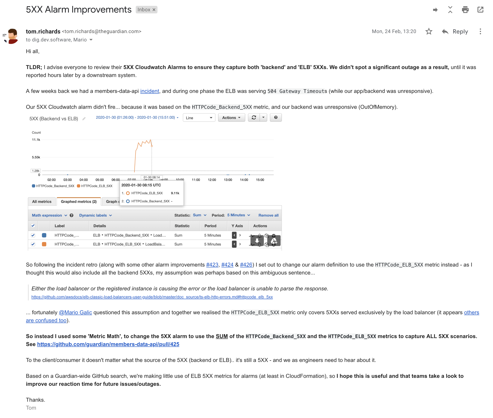

General
-------

 * Use CloudFormation or ElasticBeanStalk to define infrastructure in AWS.

Permissions
-----------

 * Applications should use IAM instance profiles to gain access to other AWS resources. 
 * Such profiles should be associated with roles that provide the minimum necessary rights.
 * Non-AWS credentials should be stored in Parameter Store, DynamoDB or S3, so that they can be retrieved via an IAM role.

EC2
---

 * An application hosted on an EC2 machine should be fully functioning following boot, or restart without human intervention.
 * Always create EC2 machines in autoscaling groups, even if that group has a minimum and maximum size of 1.
 * Use ELB healthchecks even if the app has no other HTTP endpoints, as other healthchecks are very limited.
 * Autoscaling groups should span all availability zones in a region.
 * EC2 security groups should not have globally open ports.
 * Use AMIs baked by Amigo.
 * Ensure that instances are kept up to date with new AMIs using Riff Raff scheduled deploys.

ELB
---

 * Load balancers should be cross-zone and have a connection draining policy.

SQS
---

 * Use SQS's long polling support to minimise message processing latency.

S3
--

 * Don't delete S3 buckets once they're not used any more
   * S3 bucket names are global and someone else could pick up the same name
   * This may pose a security risk if we inadvertently still use or reference the bucket
   * Instead remove everything from within the bucket and make it private if it is not already

Lambda
------

### Unexpected socket errors in Node v10 and 12 lambdas
You may occasionally see unexpected socket errors in NodeJS lambdas:

```
Error: socket hang up
    at connResetException (internal/errors.js:608:14)
    at TLSSocket.socketOnEnd (_http_client.js:460:23)
    at TLSSocket.emit (events.js:322:22)
    at endReadableNT (_stream_readable.js:1187:12)
    at processTicksAndRejections (internal/process/task_queues.js:84:21)
```

```
TimeoutError: Socket timed out without establishing a connection
```

It is a known issue with the Node 10 and 12 AWS runtimes and can happen in the following situations:

- The function has not been invoked for between 3 to 5 minutes

and the the function does one or more of the following:

- Tries to re-use connections
- Has an async root handler
- Doesn't have any other pending callbacks (file read tasks, setTimeout/Interval timer handles etc)

This started happening after a change in how the event loop works between NodeJS 8 and 10. The method AWS uses to freeze the lambda runtime after it has not been invoked for a while may not work correctly in the cases above.

The workaround is simple (if a little silly). Wrap your root handler in a setTimeout:

```javascript
exports.handler = function (event, context, callback) {
    setTimeout(function () {
        // Lambda Function code },
    0);
};
```

If you hit this problem only because you have an async root handler, you can swap it out for the traditional callback style:

```typescript
export function handler(event: Event, context: any, callback: (err: Error | null, result?: any) => void)
```

AWS advise you should only use the workaround if you see errors.

### Long-running lambda triggered multiple times from CLI `aws lambda invoke`

#### Problem
Your lambda will get triggered multiple times you trigger it synchronously using `--invocation-type RequestResponse` and it runs longer than 60 seconds, unless you set the [`--cli-read-timeout`](https://docs.aws.amazon.com/cli/latest/userguide/cli-configure-options.html#:~:text=cli%2Dread%2Dtimeout) param.

#### Details
[`--cli-read-timeout`](https://docs.aws.amazon.com/cli/latest/userguide/cli-configure-options.html#:~:text=cli%2Dread%2Dtimeout) is a general CLI param that applies to all subcommands and determines how long it will wait for data to be read from a socket. It seems to default to 60 seconds.

In the case of a synchronously executed long-running lambda, this timeout can be exceeded. The first lambda invocation "fails" (though not in a way that is visible in any lambda metrics or logs), and something (either the CLI or the lambda service, I'm not sure which) retries. The first lambda invocation hasn't really failed though - it will continue to run, possibly successfully - it's just that the CLI client that initiated it has stopped waiting for a response.

There is a StackOverflow thread about this issue here:

https://stackoverflow.com/questions/53898894/aws-lambda-timeout-when-another-long-lambda-is-invoked

#### Recommendation
Set `--cli-read-timeout` to `0` to remove the timeout and make the socket read wait indefinitely.


Alarming on 5XX Errors (CloudWatch Metrics)
---
When using EC2 and ELB/ALB there are two different counts for 5XX
- `HTTPCode_Backend_5XX` produced by your application server
- `HTTPCode_ELB_5XX` produced by the load balancer (metric name is slightly different for ALB) 

To the client/consumer it doesn't matter what the source of the 5XX (backend or ELB).. it's still a 5XX - and we as engineers need to hear about it.

Use 'Metric Math', to change any 5XX alarms to use the SUM of the `HTTPCode_Backend_5XX` and the `HTTPCode_ELB_5XX` metrics to capture ALL 5XX scenarios. For example see https://github.com/guardian/members-data-api/pull/425 



NB: see also [Resiliency and Robustness](resiliency.md) and
[Security](security.md), which have AWS-relevant recommendations.
