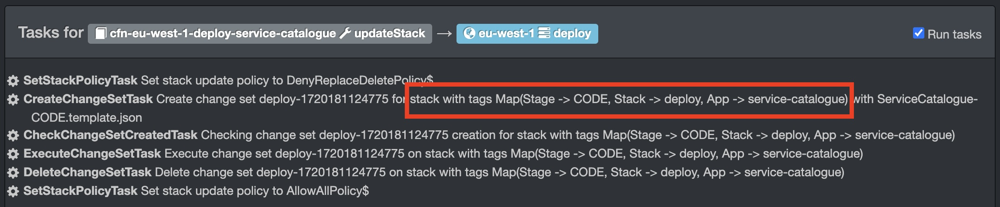
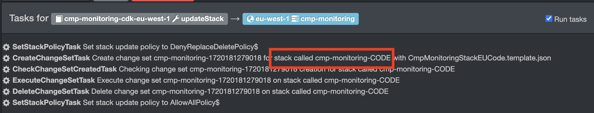

# Continuous Deployment of CloudFormation

## Background
### What is Continuous Delivery?
[Continuous Deployment](./continuous-deployment.md) (CD) is a software release process where verified changes to a codebase are deployed immediately,
and autonomously to a production environment. 
The main benefit of CD is the removal of human error, as the platform will perform the same steps over and over.

At the Guardian, [Riff-Raff](https://riffraff.gutools.co.uk/) is our standard CD platform. 
Riff-Raff is configured with a `riff-raff.yaml` file.

> [!TIP]
> - Use [this tool](https://riffraff.gutools.co.uk/configuration/validation) to validate your `riff-raff.yaml` configuration file. 
> - If using [`@guardian/cdk`](https://github.com/guardian/cdk/tree/main/src/riff-raff-yaml-file), you can auto-generate the `riff-raff.yaml` file.

### What is CloudFormation?
[CloudFormation](https://docs.aws.amazon.com/AWSCloudFormation/latest/UserGuide/Welcome.html) is a service that allows you to define your AWS infrastructure as code.
It has various benefits, including changes being made via [Pull Requests](./pull-requests.md), 
confidence in changes to PROD, as they can be tested in CODE beforehand, documentation of non-obvious decisions.

## What are the benefits of deploying CloudFormation w/Riff-Raff?
Riff-Raff offers some specific benefits when deploying CloudFormation templates.

### Application of tags
When deploying CloudFormation stacks, Riff-Raff will apply the `Stack`, `Stage`, and `App` tags ([source](https://github.com/guardian/riff-raff/blob/c94fcd0fd5723261ed6635188bef8722d85bc3eb/magenta-lib/src/main/scala/magenta/deployment_type/CloudFormation.scala#L214-L218)), 
and the `gu:repo` and `gu:build-tool` tags ([source](https://github.com/guardian/riff-raff/blob/c94fcd0fd5723261ed6635188bef8722d85bc3eb/riff-raff/app/AppComponents.scala#L102-L114)) to the CloudFormation stack.

A feature of CloudFormation is that (taggable) resources inherit the tags of their parent stack. 
A [change](https://groups.google.com/a/guardian.co.uk/g/engineering/c/Q2NkWI4-apI/m/ylNwUGS3AAAJ) was made to enable the AWS Resource Tagging Standard, 
which helps DevX [understand tag usage](https://metrics.gutools.co.uk/d/cdokcsudhxrswa/obligatron?orgId=1). 
Therefore, using Riff-Raff to deploy CloudFormation is the easiest way to meet the tagging obligation.

For example, let’s say we have this template creating an S3 bucket:

```yaml
Resources:
  MyBucket:
    Type: AWS::S3::Bucket
    Properties:
      BucketName: my-bucket
```

The bucket does not have any tags set. When deployed via Riff-Raff, the S3 bucket will have the `Stack`, `Stage`, `App`, `gu:repo`, and `gu:build-tool` tags “for free”. 
If tags were explicitly declared on the resource, the parent’s tags will be additive to them.

### Protection of stateful resources
We'll define a [stateful resource](https://github.com/guardian/cdk/blob/main/docs/stateful-resources.md) as one that will cause downtime for users of the application if accidentally deleted.
This may include, for example:
- Databases
- Messaging streams (Kinesis, SNS, SQS)
- S3 Buckets

Riff-Raff has two [modes](https://riffraff.gutools.co.uk/docs/riffraff/advanced-settings.md) of deploying CloudFormation stacks. By default, `MostlyHarmless` is used. 
In this mode, the [stack’s policy](https://docs.aws.amazon.com/AWSCloudFormation/latest/UserGuide/protect-stack-resources.html) is set such that stateful resources are prevented from being deleted. 
This helps protect against unintentional changes that could cause service interruption. The `Dangerous` mode is the opposite - all actions are enabled.

### Automatic rotation of AMIs
For our EC2 based applications, there are various requirements for the underlying instances, including regular rotation. 
This can be done when deploying CloudFormation stacks with Riff-Raff via the [`amiParametersToTags` configuration](https://riffraff.gutools.co.uk/docs/magenta-lib/types#cloudformation).

It’s worth noting a [scheduled deployment](https://riffraff.gutools.co.uk/deployment/schedule) needs to be created and rotation can also be achieved with the [`ami-cloudformation-parameter` type](https://riffraff.gutools.co.uk/docs/magenta-lib/types#amicloudformationparameter).

### History / Ability to rollback to an arbitrary version
This isn’t exclusive to CloudFormation deployments. Riff-Raff keeps a history of deployments, with information such as the date, the commit, the status, etc.

It is also possible to rollback to a previous version, either by triggering a deployment with an older build number, or redeploying a previous deployment.

## How can I tell if a CloudFormation stack is deployed w/Riff-Raff?
As mentioned above, Riff-Raff applies some tags to the CloudFormation stack. Riff-Raff also assumes an IAM role when applying changes. 
Therefore, [searching](https://metrics.gutools.co.uk/goto/L49ZNjQSR?orgId=1) for CloudFormation stacks without the `gu:repo` tag, or this role, is a good approximation.

## How do I start deploying a CloudFormation stack w/Riff-Raff?
The best ~code~ infrastructure is the ~code~ infrastructure that doesn’t exist! 
That is, before starting this work, it might be worth checking if the CloudFormation stack is still needed. 
If it isn’t, delete it.

### Identify the GitHub repository
The first place to start is to locate the repository where the CloudFormation template resides. 
This might be the application’s repository, or a [“platform” repository](https://github.com/orgs/guardian/repositories?q=platform). 
If you’re unable to immediately identify the repository, an available option is to identify a unique string in the stack’s [template](https://metrics.gutools.co.uk/goto/5LagDCQSR?orgId=1),
and perform a GitHub search for that string.

> [!TIP]
> See https://github.com/guardian/editorial-tools-platform for some examples of deploying CloudFormation templates within a "platform" repository.

### Create the `riff-raff.yaml` file
With the GitHub repository identified we create, or update, a `riff-raff.yaml` file.

In the most minimal form, the file would look similar to this:

```yaml
# This application has a CODE and PROD stage
allowedStages:
  - CODE
  - PROD

# This application is deployed in eu-west-1
regions:
  - eu-west-1

# The stack determines the AWS account this application deploys into.
# See https://riffraff.gutools.co.uk/deployinfo/data?key=credentials%3Aaws-cfn-role
stacks:
  - deploy

deployments:
  cloudformation:
    type: cloud-formation
    app: my-application

    # See https://riffraff.gutools.co.uk/docs/magenta-lib/types#cloudformation for all configuration options
    parameters:
      templatePath: my-template.yaml

      # Discover the CFN stack via the Stack, Stage, App tags...
      cloudFormationStackByTags: true

      # ...if it can't be found, do NOT create a new CFN stack
      createStackIfAbsent: false
```

### Upload the files to Riff-Raff
With the `riff-raff.yaml` file created, we can use the [GitHub Action `guardian/actions-riff-raff`](https://github.com/guardian/actions-riff-raff) 
to upload the `riff-raff.yaml` file, and the CloudFormation template file(s) for deployment with Riff-Raff.

### Check Riff-Raff targets the desired Cloudformation stack
With your project configuration uploaded to Riff-Raff, we can preview the deployment to understand which Cloudformation stack it’ll use.

There are three possible outcomes:
1. When using `cloudFormationStackByTags: true`, the [preview](https://riffraff.gutools.co.uk/preview/yaml?project=deploy%3A%3Aservice-catalogue&build=5372&stage=CODE&updateStrategy=MostlyHarmless) will show something similar to this:
   
   

2. When using `cloudFormationStackName`, the [preview](https://riffraff.gutools.co.uk/preview/yaml?project=consent%3A%3Acmp-monitoring&build=2239&stage=CODE&updateStrategy=MostlyHarmless) will show something similar to this:

   

3. Riff-Raff will error at the preview stage if it cannot find a CloudFormation stack at all.

### Perform a deployment
We’ve now confirmed Riff-Raff will impact the correct CloudFormation stack, let’s deploy!

Up until this point, we’ve not made any changes to the template. 
You might expect this first deployment to be a no-op, however, as described above, Riff-Raff will apply some tags to the CloudFormation stack. 
Therefore, the changes in this first deployment will be the application of these tags.

