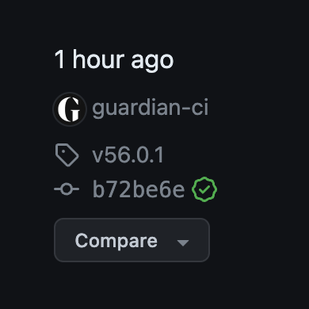

# GitHub Actions

Github actions should be used for Continuous Integration. Actions are typically used to enforce checks before merging branches into main (such as formatting, linting and testing), as well as to publish libraries or [deploy](continuous-deployment.md) build artifacts (via Riff-Raff).

## Specifying versions for actions you use

Github Actions workflows can invoke other actions via `uses` steps. When specifying the version to use, one can typically:

- Reference via a Git tag e.g `uses: actions/checkout@v4`. These correspond to tagged releases on Github - see [actions/checkout/releases](https://github.com/actions/checkout/releases) for examples.
- Reference via a Git Commit SHA e.g. `uses: actions/checkout@b4ffde65f46336ab88eb53be808477a3936bae11 # v4.1.1`.

**We recommend specifying the version of Github Actions workflows as a commit SHA**.

Since commit SHAs are immutable, the code of the underlying workflow cannot be changed for any given commit. This mitigates a security issue that arises from using tags (assuming you’re comfortable with the code present for the given SHA), where code executed by the underlying action can be changed without creating a new release. A malicious actor could exploit this in order to run code within our own workflows. See this [blog post](https://blog.rafaelgss.dev/why-you-should-pin-actions-by-commit-hash) for a complete example.

It’s important to check the source code of the action for the given commit, so you’re reasonably satisfied the action is behaving as expected (and not exfiltrating secrets, for example).

As well as specifying the commit, it’s worth combining this with a comment specifying a more readable semver version, in the format `# v0.0.1`. Dependabot also knows how to handle updates for workflows versioned with SHAs, with a comment that is kept updated with the version tag that the commit points to: see [nodejs/node/pull/51334](https://github.com/nodejs/node/pull/51334) for an example.

Note that this differs from the [Github recommendations](https://docs.github.com/en/actions/security-guides/security-hardening-for-github-actions#using-third-party-actions), as we're applying the principle of zero trust to all Github Actions.

### Finding the SHA for a given release

You can find the SHA for a particular release by navigating to the Releases page of a GitHub repository, and clicking the short SHA digest in the panel to the left of the release. The full SHA can then be copied out of the URL.



Alternatively, they can be obtained via the command line. For example:

```bash
git ls-remote --tags https://github.com/actions/checkout | sort -Vr -k2
```

## Keep actions up to date with Dependabot

Use Dependabot to keep all actions up to date. See [Keeping your actions up to date with Dependabot](https://docs.github.com/en/code-security/dependabot/working-with-dependabot/keeping-your-actions-up-to-date-with-dependabot).

## Workflow permissions

Workflow permissions control what a workflow or job is allowed to do with the GitHub API and repository resources. They are granted to the automatically created `GITHUB_TOKEN` secret, which is used to authenticate within a workflow run.

Permissions can be set at the workflow level (applying to all jobs) or overridden at the individual job level. Setting them at the job level is preferred as it applies the principle of least privilege; each job receives only the access it needs.

By default, GitHub grants `GITHUB_TOKEN` either read-only or read-write permissions depending on your repository settings. Explicitly declaring permissions in your workflow makes the intended access clear and prevents accidental over-permissioning.

### Why this matters

A compromised or malicious action running within a job could exploit broad `GITHUB_TOKEN` permissions to, for example, push code, create releases, or read secrets. Scoping permissions tightly limits the blast radius of such an event.

### Example

```yaml
# Workflow-level default: restrict everything to read-only
permissions:
  contents: read

jobs:
  build:
    runs-on: ubuntu-latest
    # Job-level override: this job needs no additional permissions
    permissions: {}
    steps:
      - uses: actions/checkout@de0fac2e4500dabe0009e67214ff5f5447ce83dd # v6.0.2

  publish:
    runs-on: ubuntu-latest
    # Job-level override: publishing requires write access to packages
    permissions:
      contents: read
      packages: write
    steps:
      - uses: actions/checkout@de0fac2e4500dabe0009e67214ff5f5447ce83dd # v6.0.2
```

We recommend that you:
- set a restrictive workflow-level default (for example, `contents: read`) and grant additional permissions per job only where needed
- prefer `permissions: {}` for jobs that require no GitHub API access
- avoid `permissions: write-all`
- review permissions when adding new jobs or actions, especially third-party ones

See the [GitHub documentation on workflow permissions](https://docs.github.com/en/actions/writing-workflows/choosing-what-your-workflow-does/controlling-permissions-for-github_token) for the full list of available permission scopes and their effects.

## GitHub app permissions

When a workflow needs to act as a GitHub app (for example, to obtain an installation token with elevated or cross-repository access), the permissions granted to that token should also be restricted to the minimum required.

Actions such as [`actions/create-github-app-token`](https://github.com/actions/create-github-app-token) accept a `permission` input that limits the scopes included in the generated installation token. Explicitly declaring these scopes follows the same principle of least privilege as job-level `GITHUB_TOKEN` permissions and reduces the blast radius if the token is misused or leaked.

### Example

```yaml
jobs:
  get-token:
    runs-on: ubuntu-latest
    permissions:
      contents: read
    steps:
      - uses: actions/create-github-app-token@1b10c78c7865c340bc4f6099eb2f838309f1e8c3 # v3.1.1
        id: app-token
        with:
          app-id: ${{ vars.APP_ID }}
          private-key: ${{ secrets.APP_PRIVATE_KEY }}
          # Restrict the installation token to only the permissions needed
          permission-contents: read
          permission-pull-requests: write
```

We recommend that you:
- always declare explicit permission inputs when generating an installation token rather than relying on the app's full permission set
- limit scopes to those actually required by the job
- review app permissions when the workflow changes, in the same way you would review `GITHUB_TOKEN` permissions

See the [GitHub documentation on creating installation access tokens](https://docs.github.com/en/apps/creating-github-apps/authenticating-with-a-github-app/generating-an-installation-access-token-for-a-github-app) and the [`actions/create-github-app-token` documentation](https://github.com/actions/create-github-app-token) for full details.
