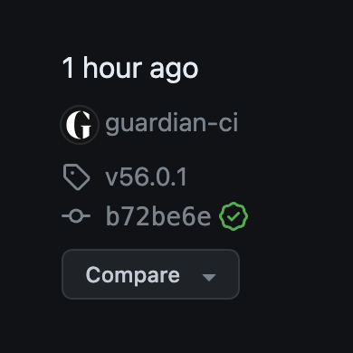

# GitHub Actions

Github actions should be used for Continuous Integration. Actions are typically used to enforce checks before merging branches into main (such as formatting, linting and testing), as well as to publish libraries or [deploy](continuous-deployment.md) build artifacts (via Riff-Raff).

## Specifying versions for actions you use

Github Actions workflows can invoke other actions via `uses` steps. When specifying the version to use, one can typically:

- Reference via a Git tag e.g `uses: actions/checkout@v4`. These correspond to tagged releases on Github - see [actions/checkout/releases](https://github.com/actions/checkout/releases) for examples.
- Reference via a Git Commit SHA e.g. `uses: actions/checkout@b4ffde65f46336ab88eb53be808477a3936bae11 # v4.1.1`.

**We recommend specifying the version of Github Actions workflows as a commit SHA**.

Since commit SHAs are immutable, the code of the underlying workflow cannot be changed for any given commit. This mitigates a security issue that arises from using tags (assuming you’re comfortable with the code present for the given SHA), where code executed by the underlying action can be changed without creating a new release. A malicious actor could exploit this in order to run code within our own workflows. See this [blog post](https://blog.rafaelgss.dev/why-you-should-pin-actions-by-commit-hash) for a complete example.

It’s important to check the source code of the action for the given commit, so you’re reasonably satisfied the action is behaving as expected (and not exfiltrating secrets, for example).

As well as specifying the commit, it’s worth combining this with a comment specifying a more readable semver version, in the format `# v0.0.1`. Dependabot also knows how to handle updates for workflows versioned with SHAs, with a comment that is kept updated with the version tag that the commit points to: see [nodejs/node/pull/51334](https://github.com/nodejs/node/pull/51334) for an example.

### Finding the SHA for a given release

You can find the SHA for a particular release by navigating to the Releases page of a GitHub repository, and clicking the short SHA digest in the panel to the left of the release. The full SHA can then be copied out of the URL.



Alternatively, they can be obtained via the command line. For example:

```bash
git ls-remote --tags https://github.com/actions/checkout | sort -Vr -k2
```

## Keep actions up to date with Dependabot

Use Dependabot to keep all actions up to date. See [Keeping your actions up to date with Dependabot](https://docs.github.com/en/code-security/dependabot/working-with-dependabot/keeping-your-actions-up-to-date-with-dependabot).
