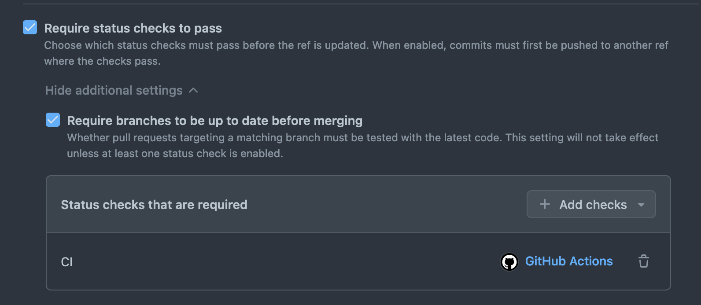
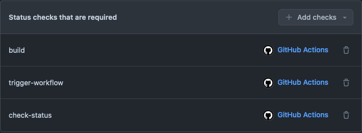

# GitHub Rulesets

Rulesets can be used to apply branch protection and CI status check rules to a repo, in the case where branch protection needs to be bypassed in certain cases. 

An example of this is the [GHA Scala Library Release Workflow](https://github.com/guardian/gha-scala-library-release-workflow), which requires branch protection to be turned off in order for it to be able to run. 

To re-apply branch protection of the default branch via rulesets:

* Edit the Custom Property `production_status` on your repo to select `production` (note, this step requires
  [GitHub-org-owner privileges](https://docs.github.com/en/enterprise-cloud@latest/organizations/managing-organization-settings/managing-custom-properties-for-repositories-in-your-organization#setting-values-for-repositories-in-your-organization)).
  This will enable an organisation-level ruleset on your repo which applies branch protection to the default branch. (N.B. This ruleset is configured to allow the 'Gu Scala Library Release' app to bypass the branch protection.)

To require CI checks to pass before merge:
* Create a second ruleset in your repo with the 'Branch protection' property 'Require status checks to pass' -> 'Require branches to be up to date before merging'.
* Type your CI workflow's job name(s) into the 'Status checks that are required' box. 
  * For example, if your repo has a CI workflow with a job called 'CI', then the setting would look like this:

  * Or if your workflow has several jobs called 'build', 'trigger-workflow' and 'check-status', it would look like this:

* Add your app (e.g. 'Gu Scala Library Release') to the ruleset bypass list.

### To enable your repo to access the GitHub App
* Add your repo to the repository access list of your app (e.g. 'Gu Scala Library Release'). A GitHub admin is required for this).