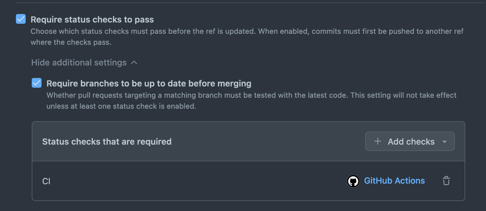
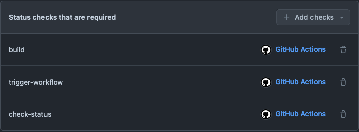

# GitHub Rulesets

Rulesets (rather than the legacy method of [Branch protection **rules**](https://docs.github.com/en/repositories/configuring-branches-and-merges-in-your-repository/managing-protected-branches/about-protected-branches))
should be used to apply branch protection and CI status check rules to a repo.

Some of the GitHub Apps we use (eg [GHA Scala Library Release Workflow](https://github.com/guardian/gha-scala-library-release-workflow))
require the ability to bypass branch protection restrictions, and it is
only possible to grant this when using GitHub **Rulesets**.

Recommended Rulesets are listed below:

## 1. Apply branch protection to the default branch

We have a ruleset for this defined at the GitHub-org level which can be automatically applied
to your repo:

* Edit the Custom Property `production_status` on your repo to select `production` (note, this step requires
  [GitHub-org-owner privileges](https://docs.github.com/en/enterprise-cloud@latest/organizations/managing-organization-settings/managing-custom-properties-for-repositories-in-your-organization)).
  This will enable the organisation-level ruleset on your repo which applies branch protection to the default branch.
  (N.B. This ruleset is configured to allow the 'Gu Scala Library Release' app to bypass the branch protection.)

## 2. Require CI checks to pass before merge

Unfortunately this ruleset can't be defined at the org-wide level, so you must manually create it
yourself:

* Create a ruleset in your repo with the 'Branch protection' property:
  'Require status checks to pass' -> 'Require branches to be up to date before merging'.
* Type your CI workflow's job name(s) into the 'Status checks that are required' box. 
  * For example, if your repo has a CI workflow with a job called 'CI', then the setting would look like this:

  * Or if your workflow has several jobs called 'build', 'trigger-workflow' and 'check-status', it would look like this:

* Add relevant GitHub apps (e.g. 'Gu Scala Library Release') to the ruleset bypass list.
