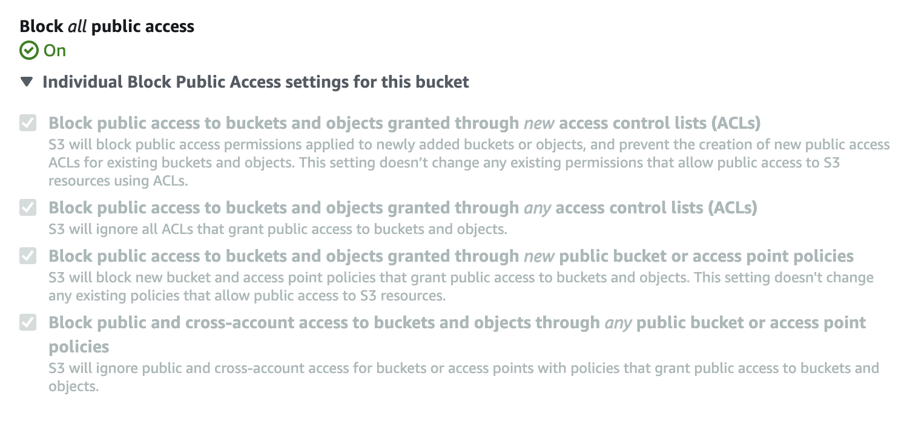

# Security

> We strive for excellence to pursue the best interests of our audience 
> and our colleagues

> We are accountable to our audience and work to live up to the trust 
> they place in us

These quotes are taken from the Guardian's values and behaviours. As an 
organisation we have a low information-security risk appetite. We strive
for excellence when protecting the privacy of our reader's data and the 
integrity of our systems. **The security of our applications, 
infrastructure and data is the highest priority.**

## Vulnerability management
You should 
[perform due diligence](https://github.com/guardian/security-hq/blob/main/hq/markdown/vulnerability-management.md) 
on your platforms to minimise common vulnerabilities in infrastructure 
and applications. Some of these vulnerabilities are not possible to fix 
automatically, so your team should plan to spend time on addressing them 
on a regular basis. 

More detailed guidance is provided in 
[Security HQ's documentation](https://github.com/guardian/security-hq/blob/main/hq/markdown/vulnerability-management.md) 
(our central tool for security information.)

## Application development

We are each responsible for the security of the code we write and staying
informed of best practices secure application development. To achieve this
you should engage with the security training and recommendations provided
internally and be aware of the latest industry guidance. There are lots of
good resources online, for example:
- [OWASP Security by Design Principles](https://www.owasp.org/index.php/Security_by_Design_Principles)
- [The OWASP Top 10](https://www.owasp.org/index.php/Category:OWASP_Top_Ten_Project)
- [The Basics of Web Application Security](https://martinfowler.com/articles/web-security-basics.html)
- [Top 10 Secure Coding Practices](https://wiki.sei.cmu.edu/confluence/display/seccode/Top+10+Secure+Coding+Practices)

## Sensitive data

**Before building an application think about what (if any) sensitive
data is involved.** Be particularly aware of any personal user data
(including email addresses).

**Have a plan for storing sensitive data safely.** Make sure the ways 
that data can be accessed are well understood. How will you ensure the
data remains safe?

**Limit access to sensitive data.** Only people and services that 
directly depend on the data should be able to access it.

**Keep sensitive data to yourself.** Keep your team's sensitive data 
within the team and under your control. Don't share it with other
teams, don't store it in cookies and don't let it sit in caches.

**Keep data only for as long as it is needed** Ensure retention policies 
are implemented aligned with the requirements set for the type of data 
you are storing. Use 
[AWS object life-cycle management](https://docs.aws.amazon.com/AmazonS3/latest/dev/object-lifecycle-mgmt.html) 
whenever possible.

**Ensure you set the right `Cache-Control` for CDN to not cache your 
response** Using `Cache-Control: no-cache` is NOT sufficient, use 
**`Cache-Control: private`** for this purpose. See 
[Cache-control semantics](https://developer.mozilla.org/en-US/docs/Web/HTTP/Headers/Cache-Control) 
and 
[Fastly config](https://developer.fastly.com/learning/concepts/cache-freshness/#preventing-content-from-being-cached)

## Secrets
**Keep secrets out of repositories.** Application secrets must not be
stored in version control, even if the repo is "private". To prevent
accidental leakage, files containing secrets should be stored away
from the project, completely outside the source tree.

**Secrets should be rotated regularly.** Automate the rotation if
possible.

**Some non-secrets should still be kept out of the public domain.** 
"Private" information that does not constitute a secret but may make
an exploit easier to achieve should be kept in private repositories.

Also see the guidance on 
[github repository contents](https://github.com/guardian/recommendations/blob/main/github.md#repository-contents)

## AWS

Centralised Reporting from AWS services and guidance is available in
[Security HQ](https://security-hq.gutools.co.uk).

### Infrastructure provisioning

**Infrastructure should be provisioned via cloudformation using the 
[Guardian CDK library](https://github.com/guardian/cdk).** Many of the 
following recommendations are encoded as defaults in the library, making
their adoption simple.

### Security patches for Compute services

See the [patching guidance below](#patching)

### Credentials

**Do not use permanent AWS credentials.** Applications running in AWS
should use `assumeRole` to gain access to other AWS resources. For
local development you should use AWS profiles to manage credentials
and these should be temporary credentials (e.g. provided by Janus).

**Permanent credentials should be rotated every 365 days.** (When they
cannot be replaced by temporary credentials.)

**Ensure that at least 2 people have IAM logins for each AWS account.**  
In the event of a VPN or Janus outage this will ensure that teams can
still access their account. These IAM users should have 2FA enabled and no
active access keys.

### SSH Access

**Direct access to production infrastructure should be a last resort.** 
Prefer automating common actions and shipping telemetry data extrernally,
which should reduce the need.

**Use SSM-Scala for SSH access.**
[SSM-scala](https://github.com/guardian/ssm-scala#ssm-scala) is a tool
executing commands on EC2 instances authenticated by IAM credentials.
The SSM Agent is baked into many of our AMI images and should be
preferentially used to permanent keys.

### VPC / Security Groups

**EC2 instances should be run in the private subnet of a VPC.** Only the
load balancer of an application should reside in the public subnet. For 
more information on VPCs and AWS see: 
https://docs.aws.amazon.com/vpc/latest/userguide/VPC_Subnets.html.

**Security Groups egress/ingress rules should be locked down as much as
possible.** There's no reason to allow open access to any EC2 instances; 
they should ideally be locked down to the load balancer and nothing 
else. 

**Port 22 access should be removed everywhere.** This is no longer required
for SSH access via SSM-scala (see above.)

### S3 Buckets

It is surprisingly easy to accidentally make public an S3 bucket or object
public. There are a number of ways of controlling access, all of which must
be correctly configured to keep private objects private.

**Prefer single logical purpose buckets, either public or 
private.** Mixing concerns makes it more complicated to configure access and
easier to get it wrong. 

**Prefer bucket-level policies to control access.** Object-level access control
is generally not recommended due to the extra risk its complexity brings. 

**For non-public buckets block all public access.**

**Enable encryption by default and encrypt private data.**

**Consider setting object lifecycle rules to remove old data.** Bucket 
versioning is also a useful setting to enable for some use cases.

## Patching

**All running EC2 instance AMIs should be less than 30 days old.** The 
refreshing of AMIs can and should be automated with a combination of 
[Amigo](https://amigo.gutools.co.uk/),
[scheduled deploys](https://riffraff.gutools.co.uk/deployment/schedule) and the 
[AMI cloudformation parameter](https://riffraff.gutools.co.uk/docs/magenta-lib/types#amicloudformationparameter)
deploy type.

**Use current LTS versions for image/container OS.** E.g. Avoid Amigo 
base images that are end of life.

**Integrate a vulnerability scanning tool and patch vulnerabilities as
fixes become available.** More guidance can be found on 
[Security HQ](https://security-hq.gutools.co.uk/documentation/vulnerability-management).

## HTTPS everywhere

**_All_ endpoints should be served over HTTPS.** Use HSTS to enforce it. 
More broadly, no plain text protocol services should be exposed externally 
(not just HTTP, but also FTP etc.)

## Personal hygiene

**Disk encryption.** All machines that you do work on must have disk
encryption enabled.

**2FA.** Whenever a service offers 2FA, you should enable it.

**Use a password manager**. Don't reuse simple passwords across
services. A password manager is a good way to help use strong
passwords. The `pwgen` command can be used to generate good passwords,
especially with the `-s` and `-y` flags (`pwgen -sy <length>`).
